# System Architecture Blueprint

**App:** plani.fyi
**Generated:** 2026-04-16
**Template Foundation:** worker-saas (Next.js 15 + Supabase + Drizzle + Trigger.dev v4)

---

## App Summary

**End Goal:** AI-powered account intelligence platform that processes meeting transcripts and ad metrics to give growth agencies always-updated, actionable visibility of every client account.

**Template Foundation Capabilities (Already Built):**
- Next.js 15 App Router with Server Actions pattern
- Supabase Auth with SSR middleware and session management
- Supabase PostgreSQL + Drizzle ORM
- shadcn/ui + Tailwind CSS v4
- Trigger.dev v4 worker infrastructure
- Stripe integration scaffold (webhooks, checkout)

**Required Extensions:**
- Anthropic Claude API for 4 LLM tasks per transcript
- Stripe API real-time queries for subscription tier checks
- Ad Platform APIs (Google Ads v17, Meta Marketing v18, LinkedIn) — Phase 2
- Per-workspace hourly cron schedules via Trigger.dev — Phase 2

---

## Architecture Diagram

```mermaid
flowchart TB

    subgraph UI["User Interface Layer"]
        Portfolio["Portfolio Dashboard\n/app/portfolio"]
        AccDetail["Account Detail Page\n/app/accounts/[accountId]\n(useRealtimeRun — live progress)"]
        TransDetail["Transcript Detail\n/app/accounts/.../transcripts/[id]"]
        CampDetail["Campaign Detail\n/app/accounts/.../campaigns\n(Phase 2)"]
        Profile["Profile Page\n/app/profile"]
        AdminUI["Admin Dashboard\n/admin/*"]
    end

    subgraph App["Application Layer — Next.js 15 App Router"]
        ServerAct["Server Actions\nvalidateAndCreateTranscriptJob\nSHA-256 hash check → duplicate detection\nquota check → tasks.trigger()"]
        Auth["Supabase Auth SSR\nMiddleware + session cookies\nrole-based route guards"]
        Webhook["/api/webhooks/stripe\n(Stripe events — optional)"]
    end

    subgraph W1["Background Job Layer — Workflow 1: process-transcript  (Phase 1)"]
        Root["ROOT: process-transcript\nOwns runId → frontend useRealtimeRun()"]
        T1["prepare-transcript\nNormalize text, extract metadata\nprogress: 0→10%\nRetry: 1"]
        T2["extract-participants\nClaude LLM: detect names from text\nCross-ref known account contacts\nInsert suggested participants\nprogress: 10→25%\nRetry: 3 + backoff"]

        subgraph Par["⚡ Promise.all() — Parallel Execution"]
            T3a["extract-tasks\nClaude LLM:\ntasks, owners, deadlines, priority\nInsert into tasks table\nprogress: 25→55%"]
            T3b["generate-summary\nClaude LLM:\nmeeting summary + updated account summary\nContext: last 5 meeting summaries\nUpdate accounts.ai_summary\nprogress: 25→55%"]
        end

        T4["detect-signals\nClaude LLM: health signal green/yellow/red\nDetect: churn_risk, growth_opportunity,\nupsell_opportunity, custom\nSignal dedup: 1 active per type per account\nadMetricsSnapshot: null (MVP) → real data (Phase 2)\nprogress: 55→90%\nRetry: 3 + backoff"]
        T5["finalize-account-update\nUpdate accounts.last_activity_at\nIncrement usage_tracking.transcripts_count\nSet transcripts.status = completed\nprogress: 90→100%\nRetry: 1 (idempotent)"]
        PMeta["Progress Tracking Pattern\nmetadata.root.set(progress, X)\nmetadata.root.set(currentStep, '...')\nChild tasks update ROOT run — not parent"]
    end

    subgraph W2["Background Job Layer — Workflow 2: sync-ad-metrics  (Phase 2)"]
        Cron["Hourly Cron Trigger\nper workspace\n(Trigger.dev schedules)"]
        S1["prepare-sync\nQuery active ad_connections in workspace\nFilter: has_active_campaigns = true\nOAuth token refresh per platform\nMark needs_reauth if unrefreshable\nprogress: 0→10%"]
        S2["fetch-ad-metrics\nPromise.all() across\nall account × platform pairs\nError isolated per pair — continues on failure\nDetect active campaigns status\nprogress: 10→60%"]
        S3["normalize-and-save\nNormalize to common schema\nUpsert ad_metrics (idempotent by account+platform+campaign+date)\nRebuild ad_metrics_snapshot per account\nprogress: 60→88%"]
        S4["trigger-signal-refresh\nfire-and-forget per account with changed snapshot\ntriggerAndForget(detect-signals, { adMetricsSnapshot })\nDoes NOT await — sync job completes independently\nprogress: 88→100%"]
    end

    subgraph Ext["External Services"]
        Claude["Anthropic Claude API\nextract-participants · extract-tasks\ngenerate-summary · detect-signals"]
        StripeAPI["Stripe API\nReal-time subscription tier query\nstripe.customers.retrieve(stripe_customer_id)"]
        StripePortal["Stripe Customer Portal\nBilling management — external link\n(no custom billing UI)"]
        GooAds["Google Ads API v17\n(Phase 2)"]
        MetaAds["Meta Marketing API v18\n(Phase 2)"]
        LnkAds["LinkedIn Campaign Manager API\n(Phase 2)"]
    end

    subgraph DB["Data Layer — Supabase PostgreSQL"]
        WSData["users · workspaces · workspace_members\nstripe_customer_id on workspaces ONLY\n(never store subscription_tier)"]
        AccData["accounts\nhealth_signal · ai_summary · last_activity_at\nhas_ad_connections (Phase 2 flag)"]
        TrxData["transcripts\ntrigger_job_id · status · progress_percentage\ncontent_hash · meeting_summary"]
        PrtData["participants (vCard: role, phone, linkedin_url)\ntranscript_participants (suggested/confirmed)"]
        SigData["tasks · signals · account_health_history\nmanual_updates · usage_tracking"]
        AdData["ad_connections · ad_metrics (historical rows)\nad_metrics_snapshots · ad_sync_jobs\n(Phase 2)"]
    end

    %% ── UI to App Layer ──
    AccDetail -->|"submit transcript"| ServerAct
    Portfolio -->|"load account cards"| ServerAct
    Profile -->|"load profile + billing"| ServerAct
    AdminUI -->|"system metrics"| ServerAct
    AccDetail -->|"auth check"| Auth
    Portfolio -->|"auth check"| Auth
    Profile -->|"auth check"| Auth

    %% ── App to Trigger.dev ──
    ServerAct -->|"tasks.trigger('process-transcript', payload)"| Root

    %% ── App to Billing ──
    ServerAct -->|"stripe.customers.retrieve(stripe_customer_id)"| StripeAPI
    StripeAPI -.->|"subscription tier"| ServerAct
    Profile -.->|"Manage Billing → external link"| StripePortal

    %% ── App to DB ──
    ServerAct -->|"Read/Write"| WSData
    ServerAct -->|"hash check · quota check\ncreate transcript record"| TrxData
    Auth -->|"session + user lookup"| WSData

    %% ── Workflow 1 Task Chain ──
    Root --> T1
    T1 --> T2
    T2 --> Par
    T3a --> T4
    T3b --> T4
    T4 --> T5

    %% ── Real-Time Progress Loop ──
    AccDetail -.->|"useRealtimeRun(trigger_job_id)"| PMeta
    PMeta -.->|"live progress updates → UI re-renders"| AccDetail

    %% ── Workflow 1 LLM Calls ──
    T2 -->|"LLM call"| Claude
    T3a -->|"LLM call"| Claude
    T3b -->|"LLM call"| Claude
    T4 -->|"LLM call"| Claude

    %% ── Workflow 1 DB State Updates ──
    T1 -->|"status: processing"| TrxData
    T2 -->|"insert suggested participants"| PrtData
    T3a -->|"insert extracted tasks"| SigData
    T3b -->|"update ai_summary"| AccData
    T4 -->|"upsert signals · update health_signal\ninsert health_history row"| SigData
    T4 -->|"update health_signal + justification"| AccData
    T5 -->|"status: completed\nlast_activity_at · usage_tracking++"| AccData
    T5 -->|"completed_at"| TrxData

    %% ── Workflow 2 Task Chain ──
    Cron --> S1
    S1 --> S2
    S2 --> S3
    S3 --> S4
    S4 -.->|"fire-and-forget\n+ real adMetricsSnapshot"| T4

    %% ── Workflow 2 Ad API Calls ──
    S2 -->|"parallel fetch"| GooAds
    S2 -->|"parallel fetch"| MetaAds
    S2 -->|"parallel fetch"| LnkAds

    %% ── Workflow 2 DB Updates ──
    S1 -->|"read active connections"| AdData
    S3 -->|"upsert ad_metrics rows\nrebuild snapshots"| AdData
    CampDetail -->|"query with date range filter"| AdData

    %% ── Color Classes ──
    classDef ui fill:#1E88E5,stroke:#1565C0,stroke-width:2px,color:#fff
    classDef app fill:#66BB6A,stroke:#388E3C,stroke-width:2px,color:#fff
    classDef trigger fill:#7E57C2,stroke:#5E35B1,stroke-width:2px,color:#fff
    classDef parallel fill:#9575CD,stroke:#7E57C2,stroke-width:2px,color:#fff
    classDef ai fill:#AB47BC,stroke:#7B1FA2,stroke-width:2px,color:#fff
    classDef pay fill:#FFA726,stroke:#F57C00,stroke-width:2px,color:#fff
    classDef ads fill:#FF7043,stroke:#D84315,stroke-width:2px,color:#fff
    classDef db fill:#26A69A,stroke:#00695C,stroke-width:2px,color:#fff

    class Portfolio,AccDetail,TransDetail,CampDetail,Profile,AdminUI ui
    class ServerAct,Auth,Webhook app
    class Root,T1,T2,T3a,T3b,T4,T5,S1,S2,S3,S4,Cron trigger
    class Par,PMeta parallel
    class Claude ai
    class StripeAPI,StripePortal pay
    class GooAds,MetaAds,LnkAds ads
    class WSData,AccData,TrxData,PrtData,SigData,AdData db
```



---

## Extension Strategy

**Why These Extensions:**
- **Anthropic Claude API** — 4 distinct LLM tasks require an external AI provider. Claude is already referenced throughout the workflow documentation. No alternative model was needed since all tasks are text-based reasoning.
- **Stripe API (real-time queries)** — Workspace-based subscriptions require knowing the current tier to enforce quotas. Queried in real-time via `stripe.customers.retrieve()` — never stored in the database.
- **Stripe Customer Portal** — All billing management delegated externally. Zero custom UI needed.
- **Ad Platform APIs (Phase 2)** — Google Ads v17, Meta Marketing v18, LinkedIn Campaign Manager for the `sync-ad-metrics` workflow. Each account has its own OAuth credentials.
- **Trigger.dev Cron Schedules (Phase 2)** — One hourly schedule created per workspace when first ad connection is established.

**Integration Points:**
- Claude API is called from within Trigger.dev tasks, never from Next.js Server Actions directly
- Stripe API is called from Server Actions (for quota tier checks) and from the Profile page server component
- Trigger.dev worker and Next.js app are separate runtime environments — connected via the Trigger.dev SDK and webhooks
- `trigger_job_id` stored in `transcripts` table is the bridge between the frontend `useRealtimeRun()` subscription and the running Trigger.dev task

**Avoided Complexity:**
- No Redis cache — subscription status is queried from Stripe directly; progress comes from Trigger.dev metadata
- No message queue beyond Trigger.dev — it handles job queuing, retries, and backoff natively
- No custom billing UI — Stripe Portal handles everything
- No GraphQL — Server Actions handle all internal data operations cleanly
- No separate microservices — Next.js monolith is sufficient for this scale

---

## System Flow Explanation

### Core Flow: Transcript Upload → Account Intelligence Update

```
1. User pastes/uploads transcript on Account Detail page
2. Server Action: validate quota (Stripe API → tier) + SHA-256 hash duplicate check
3. Server Action: insert transcripts record (status: pending), call tasks.trigger()
4. Frontend subscribes to Trigger.dev run via useRealtimeRun(trigger_job_id)
5. ROOT task orchestrates: T1 → T2 → [T3a + T3b parallel] → T4 → T5
6. Each task calls metadata.root.set(progress, X) → frontend re-renders progress bar live
7. 4 LLM calls to Claude API (participants, tasks, summary, signals)
8. DB writes at each step: participants, tasks, account summary, signals, health signal
9. On completion: accounts.last_activity_at updated, usage_tracking incremented
10. Frontend detects completion → account data refreshes automatically
```

### Billing Flow: Subscription Tier Check

```
1. User hits quota-enforced action (e.g., submit transcript)
2. Server Action reads workspace.stripe_customer_id from DB
3. Server Action calls stripe.customers.retrieve() → gets current tier
4. Tier compared against usage_tracking.transcripts_count for current month
5. If over limit → return error with upgrade prompt
6. If under limit → proceed with job creation
```

### Phase 2 Flow: Ad Metrics Sync → Signal Refresh

```
1. Hourly cron fires per workspace (Trigger.dev schedule)
2. prepare-sync: queries active ad_connections, refreshes OAuth tokens
3. fetch-ad-metrics: Promise.all() across all account×platform pairs (isolated failures)
4. normalize-and-save: upsert historical ad_metrics rows, rebuild ad_metrics_snapshots
5. trigger-signal-refresh: fire-and-forget → detect-signals with real adMetricsSnapshot
6. detect-signals runs independently: LLM evaluates metrics delta + existing context
7. Signals updated for accounts with meaningful metric changes
```

---

## Technical Risk Assessment

### Template Foundation Strengths (Low Risk)

- **Supabase Auth + SSR** — Session handling, middleware, and auth flow are battle-tested. No custom auth to build.
- **Drizzle ORM + Supabase PostgreSQL** — Type-safe queries, migrations via `db:generate`/`db:migrate` workflow already set up.
- **Trigger.dev v4** — Retry logic, backoff, and job lifecycle are handled by the framework. The `metadata.root.set()` pattern for child-task progress propagation is well-documented.
- **Server Actions pattern** — All internal operations go through Server Actions; no custom API layer needed for CRUD.

### Extension Integration Points + Mitigations

**Risk 1: LLM output reliability**
4 Claude API calls per transcript means 4 potential failure surfaces.

- **Layer 1 — Structured output with Zod:** Define an exact output schema for each LLM task and validate the Claude response before any DB write. If the response does not match the schema, the task throws and Trigger.dev retries automatically. No partial or malformed data reaches the database.
- **Layer 2 — Defensive prompts:** Each prompt includes an explicit instruction to return an empty/default JSON structure when there is insufficient evidence — instead of hallucinating values. This prevents retry loops caused by invented data that passes schema validation.
- **Layer 3 — `AbortTaskRunError` for non-retryable cases:** If Claude returns a 400 error (invalid prompt) or the transcript has fewer than 50 words, abort immediately without consuming the 3 retry attempts. Trigger.dev will not re-queue the task.
- **Retry config:** `maxAttempts: 3`, exponential backoff `1s → 2s → 4s` on all LLM tasks.

**Risk 2: Signal deduplication race condition**
Two transcript jobs completing simultaneously for the same account could each try to insert an active `churn_risk` signal.

- **DB-level enforcement:** Add a partial unique index on the `signals` table:
  ```sql
  CREATE UNIQUE INDEX signals_one_active_per_type
  ON signals (account_id, type)
  WHERE status = 'active';
  ```
  With this index, the second concurrent insert fails atomically at the database level — no application-level locking needed. The `detect-signals` task uses `INSERT ... ON CONFLICT (account_id, type) WHERE status = 'active' DO UPDATE SET description = ..., updated_at = ...` to upsert cleanly.
- **Result:** Race conditions are impossible regardless of how many concurrent jobs run for the same account.

**Risk 3: OAuth token lifecycle (Phase 2)**
Ad platform access tokens expire between hourly syncs. An unrefreshable token must not silently drop metrics without the user knowing.

- **In `prepare-sync` task:** If token refresh fails, set `ad_connections.status = 'needs_reauth'` and exclude that connection from the fetch manifest. The sync continues for all other connections — one broken token does not abort the workspace sync.
- **On Account Detail page:** When `accounts.has_ad_connections = true` and any connection has `status = 'needs_reauth'`, show a warning badge with a direct reconnect button. The user does not need to go to settings to find it.
- **On Admin Dashboard:** A "Connections needing attention" panel lists all `needs_reauth` connections across the workspace, showing account name and platform, so admins can proactively notify the responsible account manager.

**Risk 4: Stripe API latency in Server Actions**
Every quota-enforced Server Action calls Stripe in real-time. Elevated Stripe latency directly slows the user-facing submit action.

- **Explicit client timeout:** Configure the Stripe client with `timeout: 3000` (3 seconds). If Stripe does not respond within 3 seconds, the Server Action falls back to Free tier behavior conservatively — the action is blocked but with a clear message — and logs the timeout for observability.
- **Single Stripe call per request cycle:** Within one Server Action invocation, if the tier was already retrieved (e.g., to render the quota display), pass it as a parameter to the quota enforcement step rather than calling Stripe twice in the same request. No persistent cache — just parameter reuse within the same call.
- **Expand only what's needed:** Call `stripe.customers.retrieve(id, { expand: ['subscriptions'] })` — not the full customer object — to minimize response payload and latency.

### Smart Architecture Decisions

- **Single `transcripts` table** combining job tracking + content + AI results eliminates joins on the most-queried path (account history, progress checks).
- **`metadata.root.set()`** instead of `metadata.parent.set()` ensures progress propagates to the root run ID that the frontend subscribes to, regardless of task nesting depth.
- **Fire-and-forget for signal refresh (Phase 2)** — the ad metrics sync job does not wait for signal recalculation to complete. Signals update independently; no user is waiting on this flow.
- **Content hash at Server Action level** (not in Trigger.dev task) — duplicate detection happens before a job is created, preventing unnecessary LLM spend.
- **Partial unique index for signal dedup** — database-level enforcement makes the race condition physically impossible, removing an entire class of application bugs.

---

## Background Job Workflows

### Workflow 1: process-transcript

**Purpose:** Transform raw transcript text into structured account intelligence — participants, tasks, summary, health signals.

**Trigger:** User submits transcript on Account Detail page via Server Action.

**Task Chain:**
```
prepare-transcript (0→10%)
    → extract-participants (10→25%)  [Claude LLM: name detection, known contact cross-ref]
    → [Promise.all()]
        extract-tasks (25→55%)       [Claude LLM: tasks, owners, deadlines]
        generate-summary (25→55%)    [Claude LLM: meeting summary + updated account summary]
    → detect-signals (55→90%)        [Claude LLM: health signal + typed signals + dedup]
    → finalize-account-update (90→100%)  [DB writes: last_activity_at, usage_tracking++]
```

**Key Architecture Patterns:**
- **Progress Tracking:** `metadata.root.set(progress, X)` in every task — child tasks update the ROOT run ID (not parent). Frontend subscribes to root run ID via `useRealtimeRun(trigger_job_id)`.
- **Parallel Processing:** `extract-tasks` and `generate-summary` use `Promise.all()` — both run simultaneously to reduce total latency from ~40s to ~25s.
- **Database State:** Each task writes to its own domain tables immediately. No results passed through Trigger.dev payload between tasks — DB is the single source of truth.
- **Error Handling:** `maxAttempts: 3` with exponential backoff for all LLM tasks. `AbortTaskRunError` for non-retryable failures (malformed input, quota exceeded).
- **Idempotency:** Retries always operate on the same `transcriptId`. Tasks overwrite their own previous partial results in-place — no duplicate rows.

---

### Workflow 2: sync-ad-metrics (Phase 2)

**Purpose:** Fetch campaign performance metrics from connected ad platforms hourly, normalize and store historical rows, rebuild per-account snapshots, trigger LLM signal refresh for accounts with changed metrics.

**Trigger:** Hourly Trigger.dev cron per workspace. Manual trigger available from Account Detail.

**Task Chain:**
```
prepare-sync (0→10%)
    → filter has_active_campaigns = true
    → OAuth token refresh (mark needs_reauth if unrefreshable)
fetch-ad-metrics (10→60%)
    → Promise.all() across all account × platform pairs
    → Google Ads API + Meta Marketing API + LinkedIn Campaign API
    → Error isolated per pair — one failure does not abort others
normalize-and-save (60→88%)
    → Upsert ad_metrics (idempotent: account_id + platform + campaign_id + date)
    → Rebuild ad_metrics_snapshot per account
trigger-signal-refresh (88→100%)
    → fire-and-forget: triggerAndForget('detect-signals', { adMetricsSnapshot })
    → Sync job completes — signal recalculation runs independently
```

**Key Architecture Patterns:**
- **No `useRealtimeRun()`** — Admin-facing progress only. Tracked in `ad_sync_jobs` table.
- **Parallel Fetch:** `Promise.all()` across all account×platform pairs — N accounts × 3 platforms fetched concurrently.
- **Phase 2 Extension Point:** Activates `adMetricsSnapshot` parameter in `detect-signals` (was `null` in MVP). No schema changes needed — field was already in the payload interface.
- **Historical Storage:** `ad_metrics` rows are never deleted. UI queries with date range filter.

---

## Implementation Strategy

### Phase 1 (MVP — Launch Ready)

- Modify `users` table (remove role, add avatar_url)
- Create 11 new domain tables in migration order (see `initial_data_schema.md`)
- Implement Trigger.dev Workflow 1 (5 tasks + root orchestrator)
- Wire `useRealtimeRun()` to `transcripts.trigger_job_id` on Account Detail page
- Integrate Anthropic Claude API for 4 LLM tasks
- Stripe API real-time tier check in Server Actions
- Stripe Customer Portal link on Profile page
- Admin dashboard reading `usage_tracking` and `transcripts` tables

### Phase 2 (Ad Metrics)

- Create 4 ad metrics tables (`ad_connections`, `ad_metrics`, `ad_metrics_snapshots`, `ad_sync_jobs`)
- Implement Trigger.dev Workflow 2 (4 tasks + hourly cron schedule)
- OAuth integration for Google Ads / Meta / LinkedIn per account
- Update `detect-signals` task to use real `adMetricsSnapshot`
- Campaign Detail page with date range filter

### Integration Guidelines

- All domain mutations go through Server Actions, never through API routes
- API routes are for webhooks only: `/api/webhooks/stripe`, `/api/webhooks/trigger` (optional)
- Claude API is called from within Trigger.dev tasks — never from Server Actions directly (keeps long-running AI calls out of request/response cycle)
- Stripe API is called from Server Actions synchronously — keep response lightweight (`subscriptions` expand only)
- `trigger_job_id` is returned by `tasks.trigger()` in the Server Action and stored immediately in `transcripts` table — frontend receives it in the same Server Action response

---

## Success Metrics

This architecture supports the core value proposition: **"Siempre sabés cómo está cada cuenta — sin depender de la memoria del equipo."**

- **Template Optimization:** Supabase Auth + Drizzle + Trigger.dev infrastructure requires zero custom setup — focus goes directly to domain logic.
- **Focused Extensions:** One AI provider (Claude), one billing provider (Stripe), one background job platform (Trigger.dev). No infrastructure sprawl.
- **Reduced Complexity:** No Redis, no message queues beyond Trigger.dev, no custom billing UI, no microservices. Monolith handles current scale perfectly.

> **Next Steps:** Ready for implementation — start with the 12 Phase 1 database migrations, then implement Workflow 1 tasks in order, then build the Account Detail page with `useRealtimeRun()` integration.
